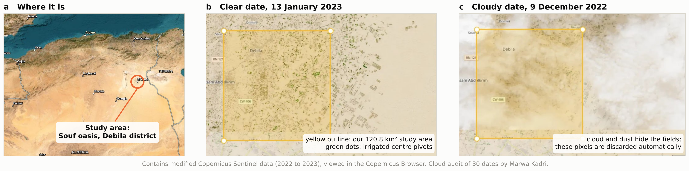
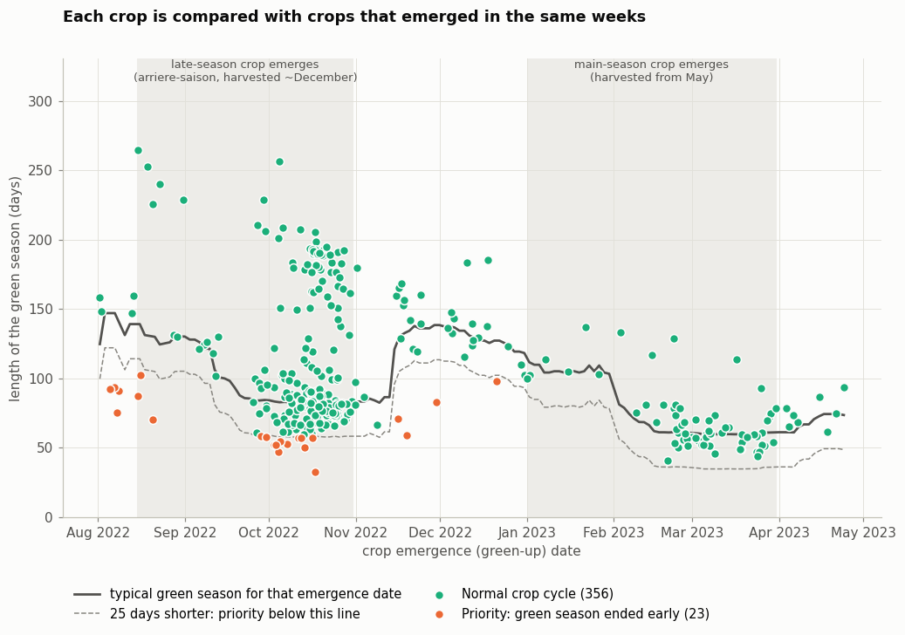
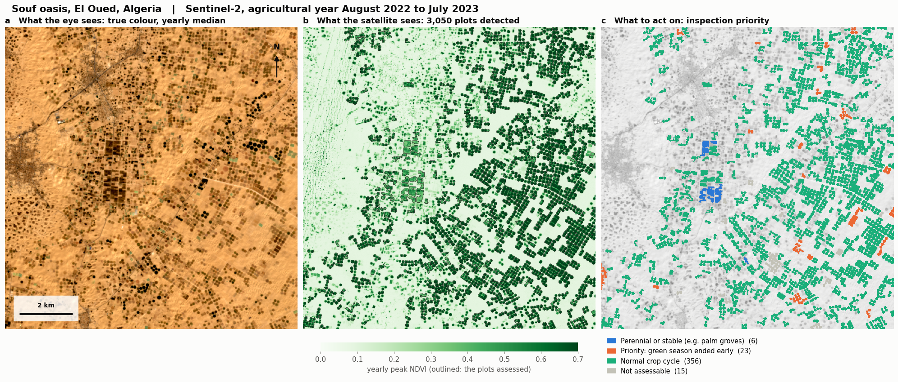
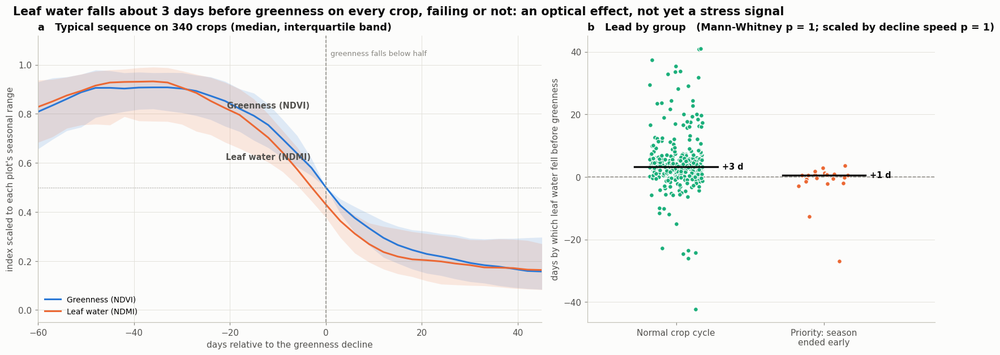
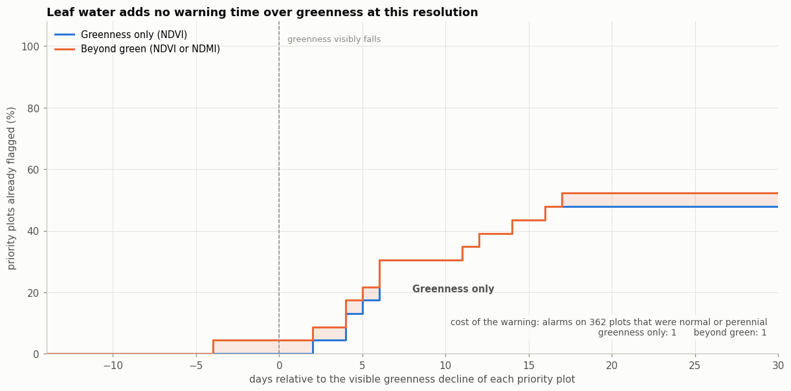
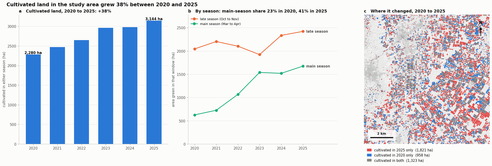

# See Beyond Green

**Plot-level crop screening and cultivated-land change in the Souf oasis (El Oued, Algeria) from open Sentinel-2 imagery**

Team Astra, Arab Youth Space Hackathon, 813 Challenge<br>
Theme: Precision Agriculture and Crop Intelligence

Asma Beghoura (team lead), Marwa Kadri, Amina Khraimech, Heba Agoudjil<br>
National Higher School of Mathematics (NHSM), Algeria

---

## Abstract

The Souf, in the Algerian Sahara, produces roughly a third of Algeria's potatoes on small centre pivots fed by groundwater (Ould Rebai et al., 2017). An extension officer cannot visit thousands of plots, and a failing crop is obvious on the ground only once the loss has occurred. The problem is harder than it looks because El Oued runs two potato calendars in parallel, a late season harvested in December and a main season harvested from May (Houben et al., 2017). A crop that ends in December is therefore usually being harvested, not failing.

We present a reproducible pipeline that uses only open Sentinel-2 Level-2A imagery, with no field boundaries and no ground data. It detects cultivated plots automatically, reconstructs each plot's phenology over a full agricultural year, and flags plots whose green season ended markedly earlier than that of crops which emerged in the same weeks. Over the 2022 to 2023 agricultural year, in an area of 120.8 km², it detected 3,050 candidate plots. Of the 400 largest, 23 were flagged for inspection: their median green season was 58 days, against 83.5 days for normal crops. Over the same area, cultivated land grew by 38% between 2020 and 2025, and the main season's share of the combined seasonal area rose from 23% to 41%.

We also tested the hypothesis behind "seeing beyond green", namely that short-wave infrared leaf-water signals reveal failing crops before greenness does. With Sentinel-2's broad bands and 20 m pixels, we found no evidence that they do. Leaf water declines a few days before greenness on most crops, failing or not. Because the same test recovers a stress-specific signal planted in synthetic data, we treat this as a finding about the data rather than a weakness of the method. It also defines what a hyperspectral sensor must add.

## At a glance

| Quantity | Value |
|---|---|
| Study area | 120.8 km² (about 10.8 × 11.2 km), Souf oasis, Debila district, about 14.5 km north-east of El Oued town; WGS84 bounds 6.903 to 7.019 E, 33.422 to 33.523 N |
| Analysis period | 1 August 2022 to 31 July 2023, one agricultural year covering both crop calendars |
| Sentinel-2 L2A scenes (scene cloud cover below 20%) | 503, on 116 acquisition dates |
| Candidate plots detected automatically (connected objects above the NDVI threshold) | 3,050 |
| Plots assessed (the 400 largest) | 380 with a complete crop cycle; 379 with a valid cohort |
| Normal crop cycle | 356 |
| **Priority: green season ended early** | **23** (6.1% of the 379 plots assessed against a cohort) |
| Perennial or stable | 6 |
| Not assessable | 15 |
| Median green season, normal and priority plots | 83.5 and 58 days |
| Median shortfall of priority plots against their cohort | 36 days |
| Leaf-water lead over greenness (median), all, normal and priority plots | +3.1, +3.3 and +0.5 days |
| Cultivated land, agricultural years 2020 and 2025 | 2,280 and 3,144 ha (+38%) |
| Main-season share of the combined late- and main-season area, 2020 and 2025 | 23% and 41% |

Every real-data number in this README is printed by the notebook, shown in its figures, or computed directly from those values. The headline values are stored in `outputs/results_summary.json`. Numbers from the synthetic test (Section 6.2) come from `tests/run_synthetic_check.py`.

---

## 1. Problem and intended user

**User:** an agricultural extension officer or farm manager responsible for many irrigated plots in El Oued.<br>
**Decision:** which plots to inspect first this season.<br>
**Output:** a ranked list of plots (`outputs/fields_ranked.csv`) and a map (Figure 1).

The obvious approaches fail here for four reasons:

1. There are no open field boundaries for the Souf, and digitising thousands of pivots by hand is impractical.
2. The two crop calendars overlap. Any rule that compares a plot with the area as a whole will read normal December harvests as failures.
3. Many pivots carry two crops in one year, so a plot's greenness can fall and rise again without any failure.
4. NDVI saturates over dense canopy (Huete et al., 2002). Differences between indices can therefore arise for optical reasons that have nothing to do with plant stress.

The method below is built around these four difficulties.

## 2. Study area

The study area lies in the Souf, in the north-eastern Algerian Sahara, and covers the agricultural land of the Debila district, with the town of Debila inside its north-western corner and Hassani Abdelkrim just beyond its western edge. Centre pivots, typically about 0.9 ha each (Houben et al., 2017), are scattered among dunes, settlements and the traditional *ghout* palm gardens. Most pivots were built by local craftsmen through a process of incremental innovation (Ould Rebai et al., 2017). The main crops are potatoes, onions and tomatoes (ESA, 2023).

Irrigation draws on the deep aquifers of the North-Western Sahara Aquifer System. Their modern recharge is real but small relative to the volumes stored and abstracted (Gonçalves et al., 2013). At the same time, and paradoxically for a desert, the shallow water table beneath the Souf has been rising since the 1960s and has flooded many ghouts. Remini (2006) attributes this to return flows from deep-well irrigation and to wastewater infiltrating the permeable sand. The water balance of the oasis is thus under pressure from both directions, and knowing where and when land is cultivated is a first step towards managing it.



*The study area in the north-eastern Algerian Sahara (a), on a clear date (b), and on a cloudy date (c). The yellow outline is the 120.8 km² boundary; the green dots inside it are irrigated centre pivots.*

## 3. Data

All imagery is Sentinel-2 MSI Level-2A surface reflectance, accessed anonymously through the Microsoft Planetary Computer STAC API (Microsoft, 2022).

- **Main analysis:** bands B02, B03, B04, B08, B11 and the scene classification layer (SCL), at 20 m in UTM zone 32N (EPSG:32632), from 1 August 2022 to 31 July 2023, keeping scenes with less than 20% cloud cover. Within the bounding box, scenes from the same day are mosaicked.
- **Cultivated-land analysis:** B04, B08 and SCL at 40 m. For each agricultural year from 2020 to 2025, two windows are used: October to November of the preceding calendar year (late-season peak) and March to April (main-season peak). This covers October 2019 to April 2025.

No credentials are required, and no imagery is stored in this repository.

## 4. Method

### 4.1 Radiometric consistency and quality control

From processing baseline 04.00 (25 January 2022), ESA stores Level-2A reflectance as `DN = 10000 × R + 1000`, and the Planetary Computer serves these numbers unchanged. The offset is assigned to each scene from its `s2:processing_baseline` property, falling back to the acquisition date only if that property is missing. The main analysis uses only scenes that carry the offset. The multi-year analysis loads scenes from before and after the change separately and corrects each group accordingly.

Pixels whose SCL class is no data, saturated, dark area, cloud shadow, cloud (medium or high probability), thin cirrus or snow (classes 0, 1, 2, 3, 8, 9, 10, 11) are discarded. Reflectance is kept only in the physical interval (0, 1.2), because near-zero denominators otherwise make the index ratios diverge. NDVI (Rouse et al., 1974) and NDMI (Gao, 1996) are kept only within (-1, 1):

```
NDVI = (B08 - B04) / (B08 + B04)      canopy greenness
NDMI = (B08 - B11) / (B08 + B11)      canopy water content
```

### 4.2 Plot detection without field boundaries

In a hyper-arid landscape, vegetation that turns green at some point in the year is, with few exceptions, cultivated. We take each pixel's maximum NDVI over the agricultural year, threshold it at 0.30, and label connected groups of pixels. Each group is one plot, and the 400 largest are assessed. Plot values on each date are means over the plot's clear pixels, so masked pixels are excluded rather than counted as zero. A detected plot is a spectrally coherent cultivated object. It may be a single pivot, or several adjacent pivots cropped in step.

### 4.3 Phenology of each plot

Each plot's clear observations are smoothed with a three-point running median and scaled to the plot's own seasonal range. **Green-up** is the last upward crossing of 50% of that range before the yearly peak. **Decline** is the first downward crossing after it. Both are linearly interpolated between observations. The **green season** is the time between green-up and decline. Plots are then sorted into five classes:

| Class | Rule |
|---|---|
| Too few observations | fewer than 20 clear dates |
| Perennial or stable | seasonal amplitude below 0.15 **and** 10th-percentile NDVI at least 0.20, as in palm groves |
| No real crop | peak NDVI below 0.25, or amplitude below 0.15 without a perennial floor |
| Incomplete cycle | no 50% crossing is found before the peak, or none after it, within the year |
| Complete cycle | everything else; these plots enter the failure test |

The perennial rule is deliberately asymmetric. A flat curve that is *not* green all year is never called perennial, so that a crop which failed to establish is not hidden behind a reassuring label.

### 4.4 Calendar-aware failure test

The core idea is to compare each crop only with crops that emerged at the same time. For plot *i* with green-up date *g<sub>i</sub>* and green-season length *L<sub>i</sub>*:
$$
C_i = \{j \neq i : |g_j-g_i| \le 20\ \text{days}\},
\qquad
\text{shortfall}_i = \text{median}_{j \in C_i}(L_j)-L_i
$$

where *j* ranges over the other plots with a complete cycle. A plot is flagged as a **priority** for inspection when its cohort has at least five members and its shortfall is at least 25 days. Crops in the same cohort share the calendar, the weather and the stage of development. The reference is therefore local and empirical: no external crop calendar is assumed, and December harvests are compared only with other December harvests.

### 4.5 Beyond green: a falsifiable test of the leaf-water lead

For every assessed plot, the decline date of NDMI is found with the same procedure as for NDVI. The **lead** is the NDVI decline date minus the NDMI decline date, so a positive lead means leaf water fell first. Leads larger than 45 days in absolute value are discarded as mismatched cycles. Three tests are applied:

1. **Is there a lead at all?** Wilcoxon signed-rank test of the lead against zero.
2. **Is it specific to failing crops?** One-sided Mann-Whitney U test, priority against normal plots.
3. **Does it survive a control for decline speed?** The same test on the lead divided by the time greenness took to fall from 80% to 20% of its range. Without this control, a crop that declines slowly would turn the same small optical offset into more days.

A stress signal is claimed only if tests 2 and 3 both pass. A lead that passes test 1 alone is an optical property of senescing canopies, not evidence of stress.

### 4.6 Causal hindcast

To ask how early a warning could have been raised, each season is replayed date by date using only observations available up to that date: trailing smoothing, and a running peak that starts at the plot's own green-up so that an earlier crop on the same pivot cannot trigger an alarm. At least four observations after green-up are required, and none of the first three can raise an alarm. An alarm is raised when two conditions hold. First, an index has fallen below its running peak by more than half of that index's typical seasonal amplitude (the median amplitude across assessed plots). Second, the crop has been green for less time than its cohort's typical season minus 25 days. This second condition is what makes an alarm mean "ending too early" rather than "being harvested"; it is not applied to perennial plots, which have no cohort. Two rules are compared: greenness only (NDVI), and beyond green (NDVI or NDMI). For transparency: index values are used causally, but three reference quantities come from the full year, namely the plot's green-up date, its cohort's typical season length and the typical amplitude of each index. Green-up precedes any decline by weeks, and in operational use the other two would be taken from earlier seasons.

### 4.7 Cultivated land across two calendars

For each agricultural year, the 90th percentile of NDVI is computed in the late-season and main-season windows. The 90th percentile resists isolated noisy observations better than the maximum. Where a window contains scenes from both processing baselines, each group is corrected separately and the pixel-wise maximum of the two percentiles is kept. A pixel is cultivated if it exceeds 0.30 in **either** window, so a farmer who switches from one season to the other is not mistaken for expansion or abandonment. Area is counted only over pixels with a valid value in every window of every year, so all years are compared on the same footprint.

---

## 5. Results

### 5.1 Two crop calendars, recovered from the imagery



*Each assessed crop is placed by its emergence date and the length of its green season. The solid line is the median season of crops that emerged within 20 days, and plots below the dashed line (25 days shorter) are flagged. The shaded bands show the regional calendar for orientation only; it is not used in the computation.*

Emergence dates form two clusters, September to October and February to March. These correspond to the late-season and main-season calendars documented for El Oued (Houben et al., 2017). The calendars were never given to the algorithm; they are recovered from the imagery. The typical season length, shown by the solid line, also changes with emergence date. This is why a single area-wide threshold would mislabel ordinary harvests as failures.

### 5.2 Where to inspect



Of the 379 plots assessed against a cohort, 356 followed a normal cycle and 23 ended their green season early. These 23 are plots to inspect, not confirmed failures (Section 6.4). The priority plots had a median green season of 58 days against 83.5 days for normal crops, a median shortfall of 36 days against their own cohort. Several of them form contiguous groups in the east of the study area. Such contiguity may point to a shared factor at the scale of a farm or a well, such as a common water source or a common management decision, rather than independent plot-level events. We report this as an observation and have not tested it formally.

### 5.3 Beyond green: an informative negative result



Leaf water fell before greenness on 80% of crops, by a median of 3.1 days (Wilcoxon p ≈ 2 × 10⁻²⁷). The figure's headline phrase "on every crop, failing or not" means on crops of both groups alike, not on every individual plot: the lead is positive on 80% of them. The lead, however, is **not larger on failing crops**: +0.5 days on priority plots against +3.3 days on normal ones (one-sided Mann-Whitney p ≈ 1). Failing crops also lost their greenness faster, taking 32 days to fall from 80% to 20% of their range against 51 days for normal crops, and a faster decline by itself shortens a lead measured in days. Once the lead is scaled by decline speed, failing crops still show no larger lead (p = 0.999).

With Sentinel-2, the leaf-water lead is therefore best explained as a generic feature of canopy senescence, and we found no evidence of a stress signature. This conclusion carries weight because the test is not blind. When a stress-specific lead is planted in synthetic data (8 days on failing crops, 2 on normal ones), the same pipeline recovers it as 8.0 against 2.0 days (p ≈ 1.5 × 10⁻²⁶, and p ≈ 3 × 10⁻²³ after the speed control; Section 6.2). Its absence in real data is therefore informative. It points to the limits of a broad-band SWIR index at 20 m, and it sets a clear benchmark for the next phase: **a hyperspectral feature earns its place only if it passes the group test that broad-band NDMI fails.**

### 5.4 Early warning: the signal arrives late



When each season is replayed with past observations only, the alarm caught 48% of priority plots using greenness alone and 52% when leaf water was added. It raised one alarm among the 362 plots classed as normal or perennial. Among the plots it caught, the median alarm came about six days *after* the visible greenness decline, and leaf water added no warning time (median gain 0 days). An alarm can fire only while a crop is at least 25 days short of its cohort's typical season, so every alarm that fired still preceded the end of a normal season by at least that margin.

This low alarm rate is partly built in, because the alarm uses the same cohort-shortfall condition that defines the categories; the meaningful results are the timing and the share of failures caught. At 20 m and with broad bands, the procedure is therefore a confirmation tool, not yet an early-warning tool. On synthetic data containing a genuine leaf-water lead, the same procedure caught 85% of priority plots with greenness alone and 87% with leaf water added, and leaf water gained a median of 7 days. This suggests that the limitation lies mainly in the signal rather than in the procedure.

### 5.5 Cultivated land, 2020 to 2025



Cultivated land in the study area grew from 2,280 ha in the 2020 agricultural year to 3,144 ha in 2025, an increase of 38%. The growth was uneven between seasons. Main-season area rose from 626 to 1,673 ha (+167%), while late-season area rose from 2,044 to 2,421 ha (+18%), so the main season's share of the seasonal total went from 23% to 41%. This agrees with field reports that farmers in El Oued, traditionally committed to the late season, have begun moving to the main season (Houben et al., 2017). The shift matters for water, because main-season crops grow into late spring, when evaporative demand in the northern Sahara is far higher than during the autumn late season.

Land use is also highly dynamic. Of the land cultivated in either year, only 1,323 ha were cultivated in both. A further 1,821 ha were cultivated in 2025 only and 958 ha in 2020 only, which reflects new pivots, abandoned pivots, rotation and fallowing together.

---

## 6. Verification and validation

### 6.1 What is verified

- **Radiometry.** The reflectance offset is applied scene by scene from the processing baseline, and is removed only where it exists.
- **Physical ranges.** Index values lie in their valid ranges, and the notebook prints the observed minimum and maximum as a check.
- **Calendar independence.** Each crop is compared only with crops that emerged within 20 days of it (Section 5.1).
- **Causality.** In the hindcast, index values are used only up to each date; the reference quantities taken from the full year are listed in Section 4.6.
- **Reproducibility.** Software versions are pinned in `requirements.txt`, and the versions actually used are written to `outputs/requirements_used.txt` on every run.

### 6.2 Independent manual cloud audit

Cloud screening is the quality control on which every later step depends, so it was audited by hand, independently of the code, by Marwa Kadri:

> I used the Copernicus Browser (Sentinel-2 L2A) to check cloud coverage over our study box, a rectangle of about 120.8 km² around Debila, El Oued. I stepped through every available date from 2022-11-04 to 2023-03-29, which is 30 dates at a 5-day interval, and judged each one by eye on the screen. A date is clear when the whole box is free of cloud, haze and shadow and the pivot circles are visible; partial when thin cloud, dust haze or a shadow covers part of the box; and cloudy when dense cloud or dust covers most of it. The result is 23 clear, 4 partial and 3 cloudy dates, and only the clear ones should be used for vegetation indices.

Seven of 30 dates, 23%, were unusable in whole or in part, which confirms that per-pixel screening is necessary rather than optional in this region. The audit also recorded brown dust haze on several dates, a contaminant that is harder for an automatic mask to catch than white cloud (Section 7). The audit covers part of the analysis year and was made by eye on browser imagery, so it is a cross-check on the need for screening, not a per-pixel accuracy measurement of the SCL mask.

### 6.3 Known-answer test on a synthetic oasis

We cannot validate against the field this season. We therefore asked a narrower question: when the truth is known, does the pipeline find it? `tests/synthetic_oasis.py` simulates an oasis with both calendars, double-cropped pivots, failing crops, palm groves, abandoned plots, cloud contamination, the baseline 04.00 offset and catalogue rate-limit errors. `tests/run_synthetic_check.py` then runs the notebook's code cells against it, skipping only the package-install line and the display of figures.

| Simulated behaviour | Objects | Flagged priority | Normal | Perennial | Not assessable |
|---|---:|---:|---:|---:|---:|
| Failing crop, either calendar | 48 | **44** | 4 | 0 | 0 |
| Normal crop, late or main season | 173 | **0** | 173 | 0 | 0 |
| Double-cropped pivot | 35 | **0** | 35 | 0 | 0 |
| Palm grove | 83 | 2 | 8 | 73 | 0 |
| Abandoned or sparse plot | 14 | 0 | 3 | 2 | 9 |

The pipeline flagged 44 of 48 failing crops and none of the 208 normal or double-cropped ones, and 44 of its 46 flags were true failures. It recovered the planted leaf-water lead (Section 5.3), and its hindcast raised alarms on only 1 (greenness only) and 2 (beyond green) of the 298 plots classed as normal or perennial. The test also exposes weaknesses: 4 of the 48 failing crops were missed, 10 palm-dominated objects were labelled as crops, and of 14 abandoned plots with sparse but persistent vegetation, 3 were labelled normal and 2 perennial. Synthetic data are cleaner than reality, so these figures are likely optimistic and should not be read as an estimate of real performance.

### 6.4 What is not validated

**There is no ground truth for this season.** No flag has been checked against observed crop condition, so the priority list is a screening indicator for human inspection, not a diagnosis. Proper validation needs a stratified sample of priority and normal plots, visited within the same season by agronomists who are not told which group each plot belongs to, or plot-level yield records.

## 7. Limitations

- **Dust is not cloud.** The SCL band is built for cloud and shadow. The manual audit (Section 6.2) found Saharan dust haze on dates that are not dense cloud, and such haze can pass a cloud mask while still depressing the indices. An EMIT mask over the same area on 27 January 2023 gives an aerosol optical depth near 0.71 at 550 nm, independently consistent with haze on the dates the audit called pale.
- **A short season is not a cause.** An early end is consistent with water stress, nutrient deficiency, disease, frost or a deliberate early harvest for market timing.
- **Merged double cycles.** A few plots show green seasons of 150 to 260 days. These are most plausibly two consecutive crops on one pivot, merged into a single cycle. They raise the cohort median for early emergence dates, so a few flags among the earliest-emerging crops (August) may be artefacts.
- **Cohorts assume similar crops.** Potatoes, onions and tomatoes that emerge in the same weeks have different normal season lengths, so some flags may reflect crop type rather than failure.
- **Objects are not parcels.** At 20 m a 0.9 ha pivot covers about 22 pixels, many of them mixed with bare sand. Adjacent pivots cropped in step can merge into one detected object.
- **Thresholds are reasoned, not calibrated.** The detection threshold (0.30), minimum peak (0.25), minimum amplitude (0.15), cohort window (20 days) and shortfall (25 days) were chosen as sensible values for a screening tool. No sensitivity analysis has been performed.
- **One area, one season** for the failure analysis. Transfer to other regions or years is not demonstrated.
- **Cultivated-land accounting.** "Cultivated in one year only" includes pivots resting that year, not only land brought into or out of agriculture. Dense palm groves above the threshold count as cultivated. The number of scenes per window varies from 27 to 91, and crops that peak outside the two windows are missed.

## 8. Installation and how to run

**In Google Colab (no installation, no credentials):** expected runtime 15 to 25 minutes, no GPU required.

1. In Colab, choose *File > Open notebook > GitHub*, paste this repository's URL and open `notebooks/ASTRA_PoC.ipynb`.
2. Choose *Runtime > Run all*. The first cell installs three packages, and everything else is preinstalled in Colab.
3. All outputs are written to the notebook's working directory (the *Files* panel in Colab). In this repository they have been placed in `data/` and `outputs/`.

**Locally (Python 3.13):**

```bash
git clone <this repository URL>
cd <repository folder>
python -m venv .venv && source .venv/bin/activate
pip install -r requirements.txt jupyter
jupyter nbconvert --to notebook --execute --ExecutePreprocessor.timeout=-1 \
        notebooks/ASTRA_PoC.ipynb --output ASTRA_PoC_executed.ipynb
```

The main study parameters (area, period, thresholds) are set in Section 2 of the notebook. Secondary constants, such as the 45-day limit on leads and the 80% and 20% levels used for decline speed, are stated in the code where they are used. Run time is dominated by reading imagery. The multi-year analysis reads twelve additional seasonal windows and can be switched off with `RUN_EXPANSION = False`. The public catalogue limits requests per network address, and Colab machines share addresses. The notebook therefore waits and retries automatically. If the errors persist, *Runtime > Disconnect and delete runtime* starts a fresh machine.

**Known-answer test (offline, optional):** run from a terminal at the repository root after installing `requirements.txt`. In Colab, put `!` in front of the command. The test files are scripts and will not run if pasted into notebook cells.

```bash
python tests/run_synthetic_check.py notebooks/ASTRA_PoC.ipynb
```

Its outputs go to `tests/synthetic_outputs/`. They are synthetic and must never be confused with the real results in `outputs/`.

### 8.1 Example input and example output

**Example input.** `data/s2_timeseries.csv` is the per-plot NDVI and NDMI time series extracted from the imagery, and it is the input to every step from phenology onward. The imagery itself is not committed, because full Sentinel-2 scenes must not be redistributed. It is retrieved by the notebook with exact, documented parameters: collection `sentinel-2-l2a` from the Microsoft Planetary Computer STAC API, bounding box 6.903, 33.422, 7.019, 33.523, dates 2022-08-01 to 2023-07-31, scene cloud cover below 20%, bands B02, B03, B04, B08, B11 and SCL at 20 m in EPSG:32632. No credentials are needed.

**Example output.** `outputs/fields_ranked.csv` is the ranked inspection list, `outputs/results_summary.json` holds the headline numbers, and the five figures in `outputs/` are the committed result files. All of them are embedded in Section 5 above.

## 9. Repository contents

```
.
├── README.md
├── requirements.txt                 pinned versions used to produce the results
├── LICENSE                          MIT, for the code and documentation
├── notebooks/
│   └── ASTRA_PoC.ipynb              the full pipeline, runs end to end
├── data/
│   └── s2_timeseries.csv            NDVI and NDMI per plot per date (example input)
├── outputs/
│   ├── fields_ranked.csv            ranked inspection list (one row per plot considered)
│   ├── results_summary.json         headline numbers quoted in this README
│   ├── requirements_used.txt        versions actually used in the run
│   ├── fig0_study_area.png
│   ├── fig_decision_rule.png
│   ├── fig1_inspection_priority.png
│   ├── fig2_beyond_green.png
│   ├── fig3_early_warning.png
│   └── fig4_cultivated_land.png
├── tests/
│   ├── synthetic_oasis.py           synthetic oasis with known answers
│   └── run_synthetic_check.py       runs the notebook against it and scores the result
└── docs/
    ├── slides.pdf                   pitch slides
    ├── *.png                        Copernicus Browser views of the study area (cloud audit)
    └── EMIT_scene_handover.pdf      hyperspectral scene identified for the next phase
```

The working notes in `docs/` quote the Copernicus Browser's own area readout for the study box, 121.63 km². That is a planar measurement of the same rectangle; the geodesic area used throughout this README is 120.8 km².

`s2_timeseries.csv` is the per-plot NDVI and NDMI time series extracted from the imagery, with the columns `field_id, date, ndvi, ndmi`: one row per plot per acquisition date, empty where the plot was fully masked. It is an intermediate product of the notebook and the input to every step from phenology onward, so it serves as the example input. `fields_ranked.csv` has one row for each of the 400 plots considered, priority plots first, with the columns `field_id, n_obs, peak, floor, amplitude, greenup, decline, season_days, cohort_season_days, cohort_size, shortfall_days, priority, category, greenup_date, decline_date`. Plots are identified by their label in the detection raster. The list does not yet carry coordinates; exporting plot outlines and centroids is listed under next steps.

## 10. Data sources and compliance

| Product | Provider and access | Period | Use | Licence |
|---|---|---|---|---|
| Sentinel-2 MSI Level-2A: B02, B03, B04, B08, B11, SCL | ESA Copernicus, via Microsoft Planetary Computer STAC API | 1 Aug 2022 to 31 Jul 2023 | plot detection, phenology, failure test, leaf-water analysis | Copernicus free and open |
| Sentinel-2 MSI Level-2A: B04, B08, SCL | as above | Oct to Nov and Mar to Apr windows, Oct 2019 to Apr 2025 | cultivated-land accounting | Copernicus free and open |

In line with the proof-of-concept data rules, no commercial, restricted or non-public imagery is used. No credentials, tokens or keys are needed or stored, and no imagery is redistributed: the repository holds only derived per-plot statistics and figures.

*Contains modified Copernicus Sentinel data (2019 to 2025), processed by Team Astra.*

## 11. Next steps

1. **Field validation in the current season.** Run the pipeline on the 2026 late season as images arrive. Before the December harvest, visit a stratified sample of flagged and unflagged plots blind to their category.
2. **Hyperspectral test.** Repeat the analysis of Section 4.5 with narrow-band data from the open EnMAP and Planet Tanager archives, using water absorption features near 970 and 1200 nm and the red edge. Sentinel-2's NDMI fails the group test; a hyperspectral feature is worth adopting only if it passes. A candidate acquisition has already been located and checked for the study area: EMIT L2A granule `EMIT_L2A_RFL_001_20230127T133045_2302709_042` (27 January 2023), whose mask reports no cloud over our box although the catalogue records the scene as fully clouded (scouting by Marwa Kadri, `docs/EMIT_scene_handover.pdf`).
3. **Method refinements.** Split double cycles at intermediate minima, run a sensitivity analysis over all thresholds, build per-plot baselines from several years, and export plot outlines and centroids as GeoJSON for use on a phone in the field.
4. **Water accounting.** Combine cultivated area by season with crop water requirements, to estimate the extra abstraction implied by the shift towards the main season.

## 12. Team, licence and attribution

**Team Astra**, National Higher School of Mathematics (NHSM), Algeria. Theme: Precision Agriculture and Crop Intelligence.

| Member | Role in this proof of concept |
|---|---|
| Asma Beghoura (team lead) | Study design, analysis pipeline, notebook, figures, README |
| Marwa Kadri | Data scouting; independent manual cloud audit of 30 dates (Section 6.2); identification of the hyperspectral scene for the next phase |
| Amina Khraimech | Review of figures, captions and the validation and limitations text |
| Heba Agoudjil | Repository structure, reproducibility testing and submission |

**Licence.** The code in this repository is released under the MIT Licence; see `LICENSE`. The written content is released under CC BY 4.0. Neither covers the satellite imagery, which remains under its own terms.

**Attribution.** Contains modified Copernicus Sentinel-2 data (2019 to 2025), processed by Team Astra, accessed through the Microsoft Planetary Computer. Built with the open-source Python scientific stack: pystac-client, planetary-computer, odc-stac, odc-geo, xarray, numpy, pandas, scipy, matplotlib and rasterio. The crop calendars of El Oued are taken from Houben et al. (2017); the remaining sources are listed in the References below. No code was copied from another project.

## References

- ESA (2023). *Earth from Space: Farming the desert.* European Space Agency. https://www.esa.int/ESA_Multimedia/Images/2023/05/Earth_from_Space_Farming_the_desert
- Gao, B.-C. (1996). NDWI: a normalized difference water index for remote sensing of vegetation liquid water from space. *Remote Sensing of Environment*, 58(3), 257-266.
- Gonçalves, J., Petersen, J., Deschamps, P., Hamelin, B., & Baba-Sy, O. (2013). Quantifying the modern recharge of the "fossil" Sahara aquifers. *Geophysical Research Letters*, 40, 2673-2678.
- Houben, S., den Braber, H., Blom-Zandstra, M., & Anten, N. P. R. (2017). *Current potato production in Algeria: an explorative research of the current potato production systems in two regions* (Report WPR-693). Wageningen Plant Research. https://doi.org/10.18174/459592
- Huete, A., Didan, K., Miura, T., Rodriguez, E. P., Gao, X., & Ferreira, L. G. (2002). Overview of the radiometric and biophysical performance of the MODIS vegetation indices. *Remote Sensing of Environment*, 83(1-2), 195-213.
- Microsoft (2022). *Microsoft Planetary Computer.* Zenodo. https://doi.org/10.5281/zenodo.7261897
- Ould Rebai, A., Hartani, T., Chabaca, M. N., & Kuper, M. (2017). Une innovation incrémentielle : la conception et la diffusion d'un pivot d'irrigation artisanal dans le Souf (Sahara algérien). *Cahiers Agricultures*, 26(3), 35005. https://doi.org/10.1051/cagri/2017024
- Remini, B. (2006). La disparition des ghouts dans la région d'El Oued (Algérie). *Larhyss Journal*, 5, 49-62.
- Rouse, J. W., Haas, R. H., Schell, J. A., & Deering, D. W. (1974). Monitoring vegetation systems in the Great Plains with ERTS. *Third Earth Resources Technology Satellite-1 Symposium*, NASA SP-351, 309-317.
